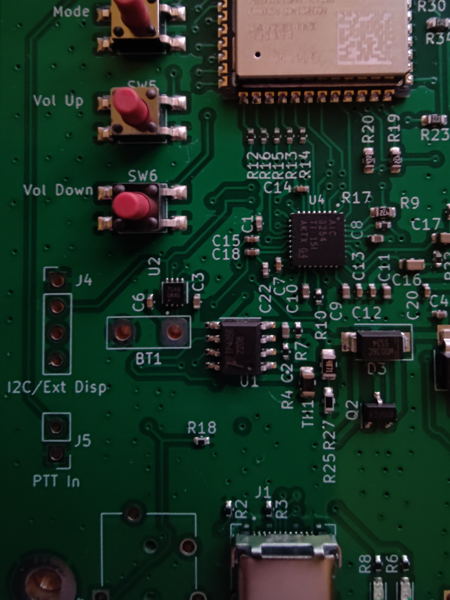
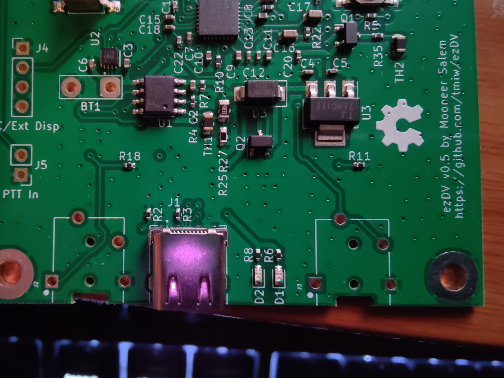
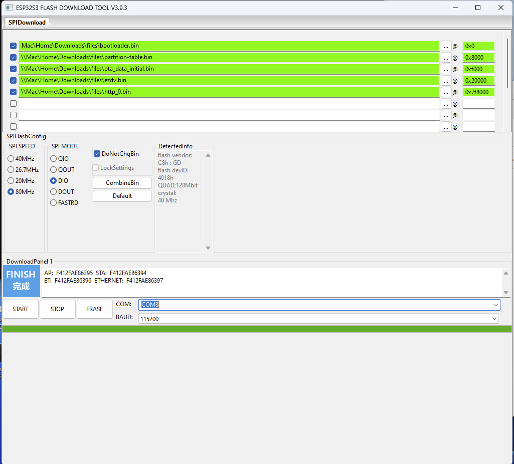
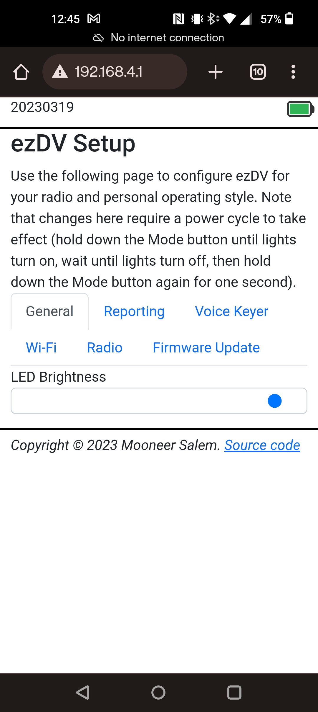
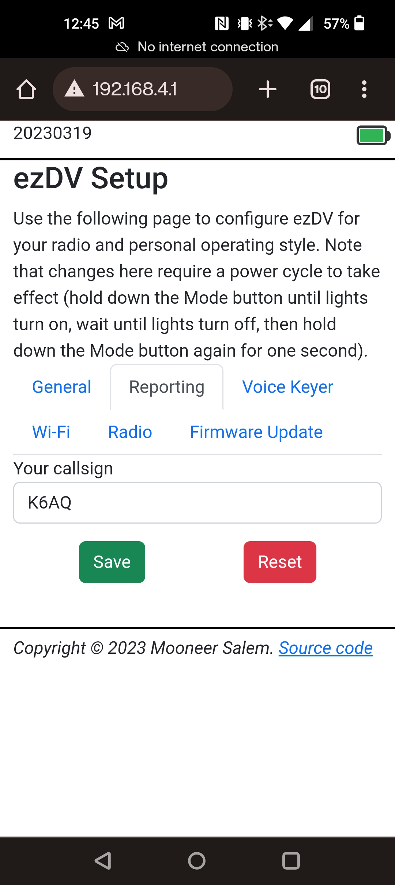
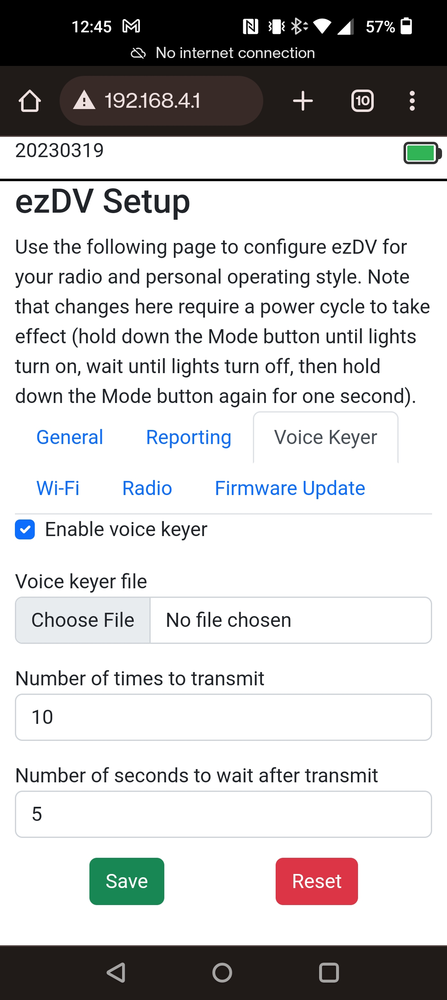
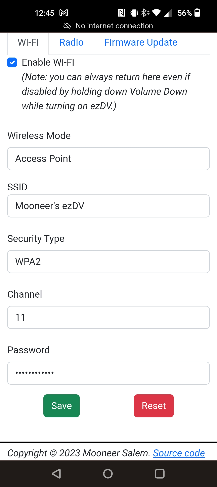
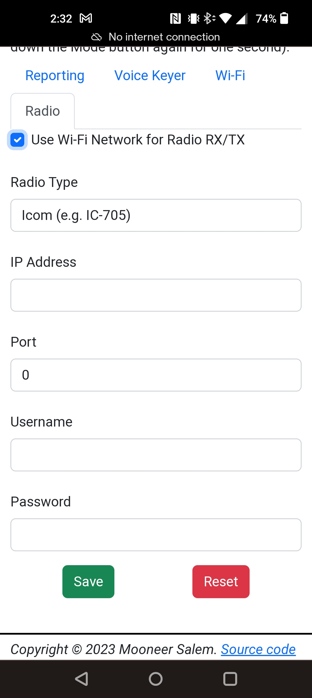
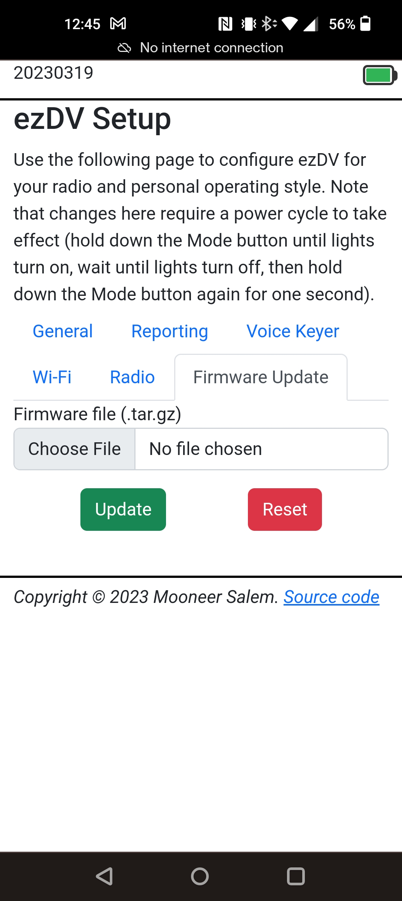

# ezDV

This repository contains both the hardware and firmware for a portable battery-powered device that can
(de)modulate [FreeDV](https://freedv.org/) from an attached radio. The board is centered around the 
following components:

* [Espressif ESP32-S3](https://www.espressif.com/sites/default/files/documentation/esp32-s3_datasheet_en.pdf)
* [TLV320 digital audio codec chip](https://www.ti.com/cn/lit/ds/symlink/tlv320aic3254.pdf?ts=1651153824042) produced by Texas Instruments ([application notes](https://www.ti.com/lit/an/slaa408a/slaa408a.pdf?ts=1651208477772&ref_url=https%253A%252F%252Fwww.google.com%252F)).

## Initial setup

### Assembly

You will need a 3.7V lithium polymer (LiPo) battery attached to BT1. One recommended battery can be purchased
[from Amazon](https://www.amazon.com/gp/product/B08214DJLJ/ref=ppx_yo_dt_b_search_asin_title?ie=UTF8&psc=1).

*WARNING: Do not puncture or otherwise damage lithium batteries as injury and/or property damage could result!
I do not take responsibility for any damage or injury due to misuse of batteries. A battery with a protection 
module (such as the one linked above) is highly recommended.*

See below for the location on the board where it should be attached:



In the above, the positive end of the battery should be soldered to the square pad (the one closest to U1).
*Note: damage to the board could result if positive and negative are swapped!*

You will also need to solder through hole TRRS jacks at J2 and J3 as shown below:



Finally, plug in a wired headset on the TRRS jack located on the right side of the ezDV board (when looking
from above). This headset should be wired as follows:

* Tip: RX audio from ezDV
* Ring 1: RX audio from ezDV
* Ring 2: GND
* Shield: TX microphone audio to ezDV

### Radios without Wi-Fi support

Radios without Wi-Fi support will need an interface cable. One end of this cable should 
be a male 3.5mm four conductor (TRRS) with the following pinout:

* Tip: TX audio from ezDV to your radio
* Ring 1: PTT to radio (this is connected to GND when you push the PTT button)
* Ring 2: GND
* Shield: RX audio from your radio to ezDV

If you have an Elecraft KX3, you can use off the shelf parts for your interface cable
(no soldering required). These parts consist of a [3.5mm splitter](https://www.amazon.com/Headphone-Splitter-KOOPAO-Microphone-Earphones/dp/B084V3TRTV/ref=sr_1_3?crid=2V0WV9A8JJMW9&keywords=headset%2Bsplitter&qid=1671701520&sprefix=headset%2Bsplitte%2Caps%2C136&sr=8-3&th=1)
and a [3.5mm TRRS cable](https://www.amazon.com/gp/product/B07PJW6RQ7/ref=ppx_yo_dt_b_search_asin_title?ie=UTF8&psc=1). The microphone
connector on the splitter should be plugged into PHONES on the KX3 while the speaker connector should be plugged into MIC.

Once you've built or purchased an interface cable, you should plug this cable into the
3.5mm jack on the left hand side of the ezDV board (when looking upward). There is also
silkscreen labeling on the back of the board corresponding to the location of the radio
jack.

### Radios with Wi-Fi support

If you have a radio that is capable of remote network access, you can configure ezDV to connect to the radio
over Wi-Fi. Currently this is supported only for the Icom IC-705. See "Web based configuration" below
below for configuration instructions.

## Building the firmware

Install [ESP-IDF v5.0](https://docs.espressif.com/projects/esp-idf/en/release-v5.0/esp32s3/get-started/index.html) and then run the following:

```
. /path/to/esp-idf/export.sh
git submodule update --init --checkout --recursive
cd firmware
idf.py build
```
## Flashing the firmware

### Using ESP-IDF

Turn on ezDV (see below) and plug it into your computer's USB port, then run the following:

```
idf.py -p /dev/ttyxxx0 flash monitor
```

Where `/dev/ttyxxx0` (or `COMx:` on Windows) is the serial port created by your operating system after plugging ezDV in.

### Using ESP Flash Tool

On Windows, you can use the ESP Flash Tool to flash ezDV. This does not require installation of ESP-IDF.

1. Download the ESP Flash Tool from https://www.espressif.com/en/support/download/other-tools.
2. Decompress all of the files in the ZIP file and execute flash\_download\_tool\_3.9.3.exe.
3. Select "ESP32-S3" for "ChipType", "Develop" for "WorkMode" and "USB" for "LoadMode" as shown below:


4. Add rows for each of the .bin files in the resulting screen:

| File Name | Offset |
|---|---|
| bootloader.bin | 0x0 |
| partition-table.bin | 0x8000 |
| ota\_data\_initial.bin | 0xF000 |
| ezdv.bin | 0x20000 |
| http_0.bin | 0x7F8000 |

Additionally, check each of the checkboxes to the left of the file name. It should look something like this, with each of the rows having a green background:



5. Set "SPI SPEED" to "80 MHz" and "SPI MODE" to "DIO".

6. Plug ezDV into your computer using a USB-C cable and turn it on by holding down the Mode button for a few seconds. Device Manager should show a new COM port named "USB/JTAG serial debug unit" or similar. Enter this COM port into the "COM" field in the application.

7. (Optional) Push the ERASE button. This will show a green "SYNC" indicator for a bit followed by "Download" and then "FINISH" as per the above screenshot. *Note: There will be no firmware installed on the board once this step finishes. You will need to reconfigure ezDV after new firmware has been flashed.*

8. Push the START button. This will go through the same indicators as step 1 but this time will also have a progress bar indicating how far it's gotten in flashing the new software. 

9. Push the STOP button and then close the application. Open the ezDV enclosure and briefly push/release the "Reset" button on the right hand side of the board. If everything went well, you'll see the four LEDs light up for a few seconds indicating that ezDV is booting normally.

### Using esptool

You can also use [esptool](https://github.com/espressif/esptool). For example:

```
esptool esp32s3 -p /dev/cu.usbmodem14101 -b 460800 --before=default_reset --after=hard_reset write_flash --flash_mode dio --flash_freq 80m --flash_size detect 0x0 bootloader.bin 0x20000 ezdv.bin 0x8000 partition_table/partition-table.bin 0xf000 ota_data_initial.bin 0x7f8000 http_0.bin
```

### Recovering from a bad flash

If the flash process fails, you can manually place ezDV into flash mode by holding down the "GPIO0/Flash" button while pushing the "Reset" button on the board. Hold "GPIO0/Flash" for a second or so after releasing Reset, then release. You can then use ESP-IDF, the ESP Flash Tool or esptool to flash ezDV with working firmware.

### Using the Wi-Fi interface

You can also update the firmware wirelessly. See "Web based configuration" below for info.

## Using ezDV

ezDV has four buttons on the left, in order from top to bottom:

* PTT
* Mode
* Volume Up
* Volume Down

as well as four status LEDs on the right hand side (again from top to bottom):

* PTT (red; on if transmitting)
* Sync (green; on if ezDV can decode an incoming FreeDV signal)
* Overload (red; on if the incoming RX/TX audio is clipping)
* Network (blue; will blink if it has a network connection and will be solid if connected to the radio)

To turn on ezDV, press and hold the Mode button for >= 1 second. All four LEDs on the 
right hand side of the board should light briefly and then extinguish. You will also hear "ANA" in Morse Code
on your wired headset corresponding to analog passthrough mode. Holding this button again for >= 1 second will
result in ezDV turning off (with "73" also being piped through the headset in Morse Code, corresponding to the
well-known ham radio term for "goodbye").

Pushing the Mode button briefly while in receive will cycle through the following modes:

* FreeDV 700D ("700D" will beep in Morse code)
* FreeDV 700E ("700E" will beep in Morse code)
* FreeDV 1600 ("1600" will beep in Morse code)
* Analog passthrough ("ANA" will beep in Morse code)

Additionally, if you hold down PTT and then push Mode briefly, the voice keyer function will activate. This
requires additional configuration to use (see "Web based configuration" below). Pressing any button after
doing this will stop the voice keyer.

The Volume Up and Down buttons adjust the receive and transmit audio depending on if the PTT button is
also held. For best results, transmit audio should be adjusted while in 700D/700E/1600 mode such that
the ALC indicator on your radio is just barely showing (similar to how to configure data modes). 

## Web based configuration

By default, Wi-Fi on ezDV is disabled for security reasons. To enable it (or recover from bad configuration), 
hold down the Mode and Volume Down buttons until ezDV turns on. This will cause ezDV to create an access point
named "ezDV" followed by the last two octets of its MAC address. From there, you can connect your PC or mobile
device to that network and open http://192.168.4.1/ in your Web browser; this will show a page that looks like
the below: 



From here, you can choose one of four tabs:

* General: Contains miscallenous ezDV configuration options.
* Reporting: Configures your callsign (to be encoded in FreeDV transmissions for reporting to [PSK Reporter](https://pskreporter.info/)).
* Voice Keyer: Configures ezDV's voice keyer feature.
* Wi-Fi: Configures how ezDV connects to Wi-Fi.
* Radio: Configures how ezDV connects to your network-enabled radio.
* Firmware Update: Allows the user to perform a firmware update on ezDV.

Note that most changes here will require a power cycle in order to take effect.

### General

Currently, this tab allows the user to adjust the brightness on the LEDs on the front of ezDV.

### Reporting

For PSK Reporter functionality, there is only one field here: your callsign. (ezDV does not report to PSK Reporter
itself due to it being intended for use in environments without reliable internet access.) Leaving this field blank
will transmit no callsign when using one of the FreeDV modes:



### Voice Keyer

On this tab, you can configure the Voice Keyer feature:



The fields to configure here are as follows:

* "Enable voice keyer": Enables or disables the voice keyer. If disabled, pushing Mode while transmitting has no effect.
* "Voice keyer file": Provide a mono, 8 KHz sample rate file consisting of audio that should be encoded and transmitted.
* "Number of times to transmit": The number of times that ezDV should transmit your voice keyer file.
* "Number of seconds to wait after transmit": The number of seconds to wait after transmitting the voice keyer file before transmitting it again.

### Wi-Fi

This tab allows you to configure ezDV to connect to a Wi-Fi network or to create its own:



The fields to configure here are as follows:

* "Wireless Mode": either "Access Point" (if you want ezDV to create its own access point) or "Client" (if you want ezDV to connect to an existing network).
* "SSID": either the network to connect to (if "Client") or the name of the network ezDV is creating (if "Access Point").
* "Security Type": valid only for "Access Point" mode and determines how the network should be secured (WEP, WPA, WPA2 and Open are supported).
* "Channel": valid only for "Access Point" mode and determines the 2.4 GHz Wi-Fi channel that ezDV should listen on.
* "Password": the password ezDV should use to connect to the network (or is required to connect to ezDV).

### Radio

This tab allows you to configure ezDV to connect to a network-enabled radio. Note that this tab is disabled unless Wi-Fi is enabled:



The fields to configure here are as follows:

* "Radio Type": the type of radio ezDV will connect to (currently only the IC-705 is supported).
* "IP Address": the IP address that ezDV should use to connect to the radio. Typically this is 192.168.4.2 if ezDV is an access point or 192.168.59.1 if the IC-705's wireless network is used.
* "Port": the port to connect to on the radio. This is typically 50001 if using the IC-705.
* "Username": the username to use to connect to the radio.
* "Password" the password to use to connect to the radio.

### Firmware Update

This tab allows you to flash new firmware to the ezDV board. Simply provide a .tar.gz file containing ezdv.bin and http.bin files from the desired version and click on the "Update" button. If successful, turning ezDV off and on again will cause the new firmware to take effect:



## Hardware Test Mode

ezDV has a hardware test mode that can be used to ensure that the board is functioning properly. To access this mode,
hold down the PTT button while turning on ezDV. Once ezDV starts, you will hear audio tones at 1275 Hz (user jack) and 
1725 Hz (radio jack) and all LEDs will be lit at 50% duty cycle. If the board is functioning properly, only the frequency
associated to the given jack (and harmonics, if square wave) will be in the output audio. Pushing the Mode button will cycle 
through the following:

* Sine tones at both jacks.
* Sine tone only on user jack.
* Sine tone only on radio jack.
* Square tones at both jacks.
* Square tone only on user jack.
* Square tone only on radio jack.
* No audio on either jack.

Additionally, pushing any of the buttons will extinguish the following LEDs:

* PTT: PTT (red)
* Mode: Sync (green)
* Volume Up: Overload (red)
* Volume Down: Network (blue)

Releasing the button will re-illuminate the associated LED.

To shut down ezDV while in this mode, long-press the Mode button as with regular operation.

## License

This project is subject to the terms of the [TAPR Open Hardware License v1.0](https://tapr.org/the-tapr-open-hardware-license/) (schematics, 
other hardware documentation) and [GNU General Public License v3.0](https://www.gnu.org/licenses/gpl-3.0.en.html) (firmware).
