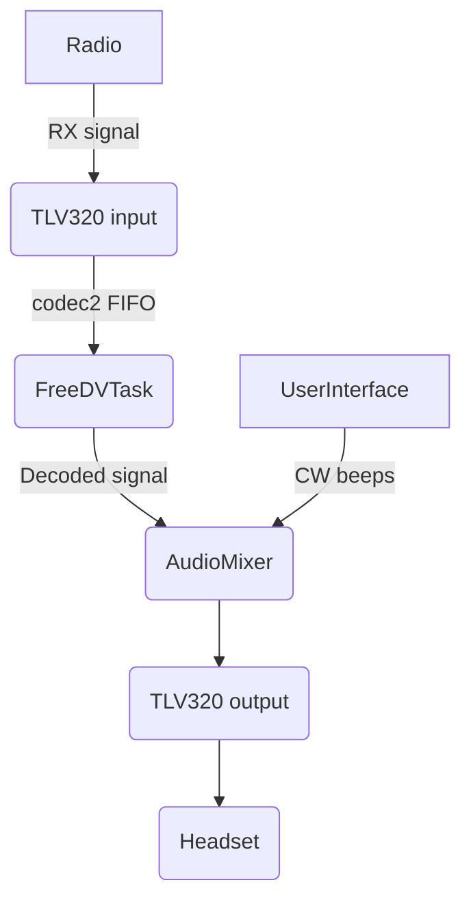
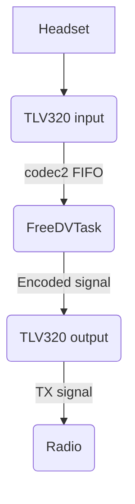

# Theory of Operation

## Introduction

This document describes the general architecture of ezDV and provides details that may be useful for those developers
that want to contribute to the project.

## Hardware Architecture

ezDV uses a ESP32-S3 microcontroller to execute the firmware in this repository. This firmware interfaces with several 
peripherals to perform its basic functionality:

* Texas Instruments TLV320AIC3254 audio codec chip over I2C (to provide configuration information) and I2S (for audio
I/O) to send and receive audio data to a wired headset and/or a radio.
* MAX17048 over I2C to handle battery status measurement (i.e. remaining battery capacity).
* Buttons and LEDs using the ESP32-S3's built-in GPIOs.

## Software Architecture

### System Components

The ezDV firmware is split into several tasks to perform various actions. These tasks are divided into several categories:

* Audio (`firmware/audio`) -- handles higher level audio-related tasks
    * AudioMixer - Mixes two audio streams together
    * BeeperTask - Generates CW beeps based on provided input
    * FreeDVTask - Passes audio to/from the [Codec2](https://github.com/drowe67/codec2) library for encoding and decoding
    * VoiceKeyerTask - Handles voice keyer functionality
* Drivers (`firmware/drivers`) -- handles communication with peripherals
    * ButtonArray - handles processing of interrupts due to button presses
    * LedArray - handles display of built-in LEDs
    * MAX17048 - handles communication with the MAX17048 fuel gauge chip over I2C
    * TLV320 - handles communication with the TLV320 audio codec chip
* Network (`firmware/network`) -- handles logic involving Wi-Fi communication
    * FlexRadio support (`firmware/network/flex`)
        * FlexTcpTask - handles CAT control of a configured Flex radio
        * FlexVitaTask - handles audio I/O (analog and digital) to/from a configured Flex radio
    * Icom support (`firmware/network/icom`)
        * IcomSocketTask - handles UDP connection to one of the Icom remote ports (control, audio, CAT control)
    * Network interfaces (`firmware/network/interfaces`)
        * WirelessInterface - handles bringup/teardown of the built-in Wi-Fi on the ESP32.
        * EthernetInterface - handles bringup/teardown of the W5500 Ethernet module (if attached).
    * FreeDVReporterTask - handles reporting to [FreeDV Reporter](https://qso.freedv.org/)
    * HttpServerTask - handles serving of ezDV's built-in web interface
    * NetworkTask - handles bringup and teardown of the configured network interfaces (Wi-Fi, Ethernet)
* Storage (`firmware/storage`) -- handles configuration and firmware storage
    * SettingsTask - handles storage of configuration settings
    * SoftwareUpdateTask - handles updating of the ezDV firmware from the web interface
* User Interface (`firmware/ui`) -- handles the physical interface with the user
    * FuelGaugeTask - executes when ezDV is turned off (but plugged into USB power) and provides live charging updates via the built-in LEDs
    * RFComplianceTesTask - executes when ezDV is in Hardware Test Mode and provides ways to perform basic validation of the physical hardware
    * UserInterfaceTask - executes when ezDV is turned on normally and directs the rest of the system to perform tasks based on input from buttons

These tasks inherit a thin wrapper around FreeRTOS/ESP-IDF called `DVTask` (located in `firmware/task`) and optionally contain one or more `DVTimer` 
instances if periodic execution of code is required. 

### Inter-Component Messaging

`DVTask` enables the usage of a publish/subscribe model for each task's public interface. This prevents interaction with a task's private data,
reducing the likelihood of certain classes of bugs (such as race conditions). Subscribing to messages is typically done by calling the 
`registerMessageHandler()` method of `DVTask` with the name of the method to call upon receiving a certain type of message. Message handler
methods have a signature similar to the following:

```c++
void ClassName::onHandleMessage_(DVTask* originTask, MessageType* message)
{
    // actions here
}
```

`MessageType` is a class that typically inherits from `DVTaskMessageBase`. `DVTaskMessageBase` is a template class
that takes an integer message ID and a string corresponding to the name of the message category (defined by the `DV_EVENT_DECLARE_BASE`
macro inside the message's .h file and `DV_EVENT_DEFINE_BASE` inside the corresponding .cpp file. For example, in an .h file, you may
have something similar to the following:

```c++
extern "C"
{
    DV_EVENT_DECLARE_BASE(FREEDV_MESSAGE);
}

enum FreeDVMessageTypes
{
    SYNC_STATE = 1,
    // additional message types here
};

class FreeDVSyncStateMessage : public DVTaskMessageBase<SYNC_STATE, FreeDVSyncStateMessage>
{
    // definition here
};
```

and in the .cpp file, you'd have only the following:

```c++
extern "C"
{
    DV_EVENT_DEFINE_BASE(FREEDV_MESSAGE);
}
```

In each message type, the contents of the message are typically defined as public properties as `DVTask` internally
treats them similarly to C structs. Additionally, the size of the message should be known in advance and constant
(for example, the size shouldn't vary based on the length of a string inside the message).

To send a message to a component, tasks typically call the `publish()` method, i.e.

```c++
MessageType message(1, 2, 3);
publish(&message);
```

`publish()` sends the provided message to all tasks that are subscribed to it. Depending on the message type,
this can cause multiple tasks to process the message at the same time. Alternatively, if a task has a pointer
to another, it can use `post()` on the task instead to send only to that task. For example:

```c++
DVTask* destinationTask = getDestinationTask();
MessageType message(1, 2, 3);
destinationTask->post(&message);
```

### Audio Routing

#### Receive

Receive audio is routed through ezDV as follows:



#### Transmit

Transmit audio is routed similarly to receive audio. The main difference is that `AudioMixer` is not used:



## Contributing to ezDV

To contribute to ezDV, simply fork this repo and make the required changes, then open a pull request. Note that
for a PR to be merged, the following must currently occur:

* All GitHub actions must pass successfully (i.e. no compiler errors).
* For new/modified functionality, the user manual (in the `manual` folder) must be updated accordingly.

If you have any questions, feel free to reach out in the pull request or by emailing the digitalvoice mailing list.
Thank you for your help in making ezDV even better!
