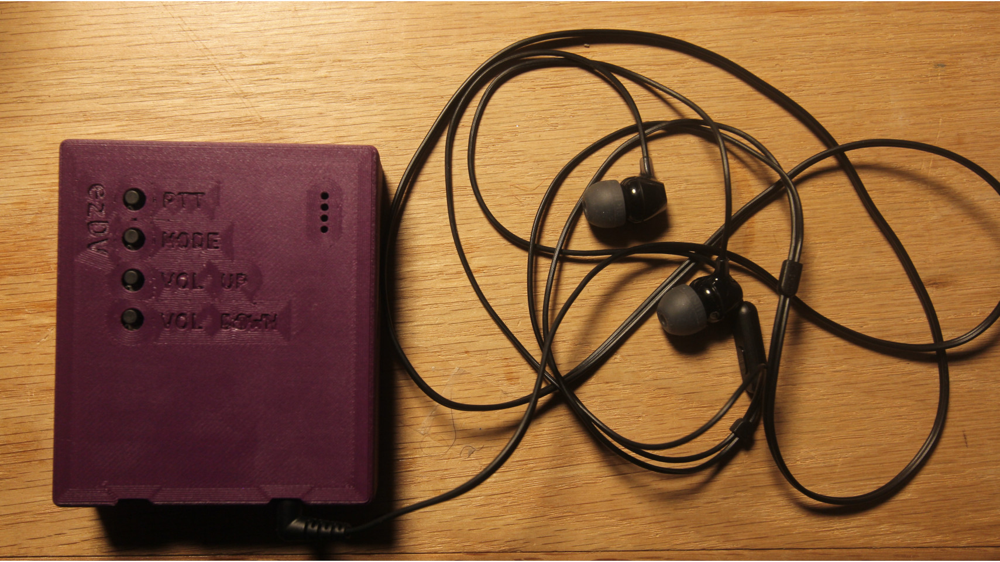
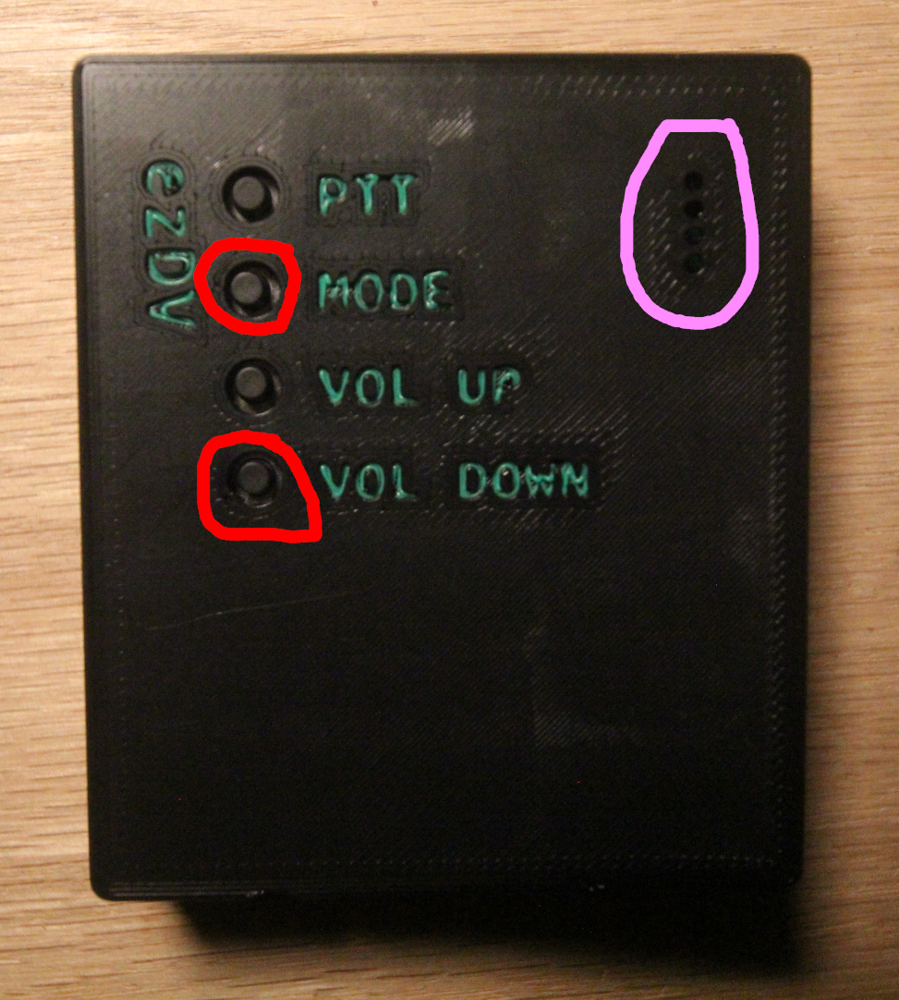
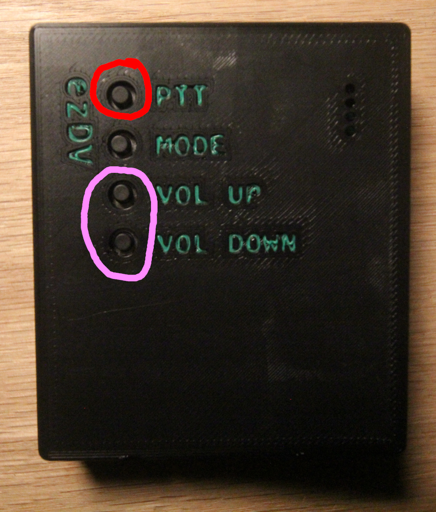
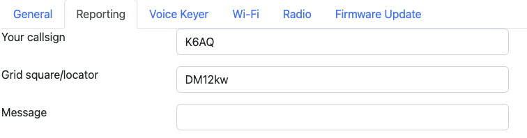
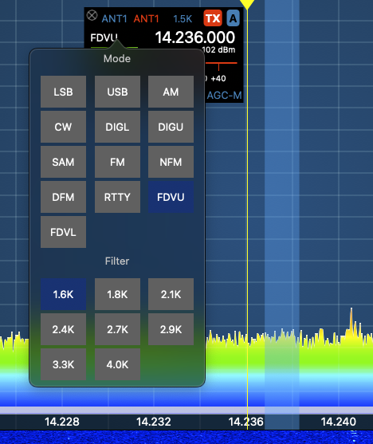

# Setting up ezDV

There are several steps required to get ezDV up and running with your radio.

## Initial assembly

If ezDV did not already come with a battery, you will need to obtain a 3.7V lithium polymer (LiPo) battery.
One recommended battery can be purchased [from Amazon](https://www.amazon.com/gp/product/B08214DJLJ/ref=ppx_yo_dt_b_search_asin_title?ie=UTF8&psc=1).

*WARNING: Do not puncture or otherwise damage lithium batteries as injury and/or property damage could result!
Neither the project nor its creator take responsibility for any damage or injury due to misuse of batteries. A 
battery with a protection module (such as the one linked above) is highly recommended.*

The battery should be plugged into the BT1 connector on the bottom of the ezDV circuit board, which is
the circled connector below:

Once a battery is attached, you should flip the switch to the right of the BT1 connector upwards (towards the back of the ezDV board)
to connect the battery to the rest of the board. This switch is designed to allow for long-term storage or shipping of ezDV without 
discharging the battery. Note that ezDV may power on immediately after flipping this switch; you can power it down by pushing
and holding the Mode button (second button from the top when looking downward) until red lights turn on on the right-hand side.

*Note: it is not recommended to use this switch for normal operation of ezDV. Some features require an orderly shutdown of ezDV
(which is accomplished by using the Mode button) and may not function properly if power is suddenly lost.*

Next, plug ezDV into a USB-C charger (similar to what would be done to charge a cell phone or portable power bank). A red LED
may light on the bottom of ezDV indicating that the battery is charging as well as some or all of the LEDs on the right hand side
(indicating its current state of charge in 25% increments). When ezDV is done charging, a green LED will turn on
and the red LED will turn off. This may take several hours or more depending on the state of the battery.

Finally, plug in a wired headset on the TRRS jack located on the right side of the ezDV board (when looking
from above). This headset should be wired for compatibility with Android phones, which is as follows:

* Tip: RX audio from ezDV
* Ring 1: RX audio from ezDV
* Ring 2: GND
* Shield: TX microphone audio to ezDV

Once attached, ezDV will appear as follows:

## Radio wiring

### Radios without network support

Radios without network support will need an interface cable. One end of this cable should 
be a male 3.5mm four conductor (TRRS) with the following pinout:

* Tip: TX audio from ezDV to your radio
* Ring 1: PTT to radio (this is connected to GND when you push the PTT button)
* Ring 2: GND
* Shield: RX audio from your radio to ezDV

There is also silkscreen labeling on the back of the board corresponding to the location of 
the radio jack that indicates the pinout. This jack is on the left hand side of ezDV when looking
downward at the front of the device.

More information on example wiring configurations for various radios can be found in the [Example Wiring Configurations](#appendix-example-wiring-configurations)
section.

### Radios with network support

If you have a radio that is capable of remote network access, you can configure ezDV to connect to the radio
over Wi-Fi or Ethernet. Currently this is supported only for the [FlexRadio](https://www.flexradio.com/) 
000/8000 series radios and the Icom IC-705.

#### Flex 6000/8000 series radios

Ensure that you can access your radio using the SmartSDR software from a PC on the same network (i.e. *not* using SmartLink).
Once this is confirmed, skip to [Initial Configuration](#initial-configuration).

#### Icom IC-705

Several settings will need to be adjusted in the IC-705 before it can be used with ezDV. See "Configuring Wi-Fi on the Icom IC-705"
or your radio's user manual for more information on configuring Wi-Fi.

## Initial configuration

To perform initial configuration of ezDV, push and hold both the Mode and Volume Down buttons at the same
time until all four of the LEDs on the right hand side of ezDV turn on.

Once the LEDs turn off, go to your PC or cell phone's Wi-Fi configuration and join a network named "ezDV xxxx",
where "xxxx" is the last few alphanumeric digits of its MAC address (a unique identifier for each network device). 
Once joined, open your Web browser and navigate to http://192.168.4.1/. You should see a page similar to the following:

### Transmit audio levels

#### Flex 6000/8000 series

ezDV uses a hardcoded transmit level when connected to the Flex 6000/8000 series of radios, so adjusting the transmit level on 
ezDV has no effect.

#### Other radios

*Note: for the Icom IC-705, this can only be done after configuring Wi-Fi and the radio connection.*

ezDV's transmit audio levels will need to be adjusted to ensure that your radio does not indicate too much ALC, similar
to other HF digital modes. You can adjust the transmit audio by pushing the Volume Up or Volume Down buttons
while holding the PTT button as indicated below:

For most radios, ezDV's transmit level should be such that little to no ALC is indicated on the radio display. The specific 
ALC level required depends on the radio, so your radio's user manual is the best source for determining this. Alternatively,
you can increase the TX audio level until your power output stops increasing, then decrease it again until your power output
begins to decrease.

*Note: it's recommended to have your radio attached to a dummy load while adjusting your transmit audio levels to prevent
interference to other operators.*

### Network configuration

*Note: this is optional unless you are using a radio with network support or wish to use other Internet connected features
(such as reporting to [FreeDV Reporter](https://qso.freedv.org/) and [PSK Reporter](https://pskreporter.info)).*

Click or tap on the "Network" tab and check the "Enable Wi-Fi" checkbox. You'll see something similar to the following:

*Note: experimental support exists for Ethernet on ezDV. See "Setting Up Ethernet Support" for more information.*

To connect ezDV to the network that your radio is on, select "Client" for "Wireless Mode". Select your Wi-Fi network from
the list that appears (which may take a few seconds while ezDV scans for your network) and enter its password (if required).
If desired, you can also change ezDV's name by modifying the "Hostname" field; this may allow you to access ezDV later by entering
this name instead of trying to find its IP address. Click or tap Save to save your Wi-Fi settings.

### Radio connection

*Note: this is optional unless you are using a radio with Wi-Fi support.*

Click on the "Radio" tab and check the "Use Network for Radio RX/TX" checkbox. Select your radio model in the "Radio Type"
drop-down list, which will bring up different fields depending on the radio being configured.

#### Flex 6000/8000 series

Select the name of your radio from the "Radio" drop-down list as shown below. Your radio's IP address should automatically
be filled in the "IP Address" field:

Click or tap Save to save the radio configuration.

#### Icom IC-705

Enter your radio's IP address, username and password that you saved when you configured Wi-Fi on the IC-705:

Click or tap Save to save the radio configuration.

### Reporting configuration

It is highly recommended to configure your callsign and grid square. This has several benefits:

1. If ezDV is lost or stolen, someone can access its Web page and use callsign databases like [QRZ](https://www.qrz.com) to find a way to get it back to you.
2. Other users will be able to decode your callsign and report spots on [FreeDV Reporter](https://qso.freedv.org) and [PSK Reporter](https://pskreporter.info).
3. If ezDV has Internet access, it will also be able to decode callsigns from received signals and report them itself to FreeDV Reporter and PSK Reporter.

To do this, click or tap on the "Reporting" tab and enter your callsign and grid square where prompted:

If desired, you can also enter a short message that will appear on FreeDV Reporter. This message is transmitted solely over the Internet, not over RF.

Once done, click or tap Save to save the reporting configuration.

### Final setup

After your radio, Wi-Fi and reporting configuration are complete, simply click or tap on the General tab and then click or tap on the Reboot button.
ezDV will first show two red LEDs on the right hand side for a few seconds, then show all four LEDs for a few seconds, then turn them all off. If you're
using a wired connection to ezDV, it is now ready for use.

If you configured a Wi-Fi network and radio for ezDV to connect to, ezDV should then begin blinking a blue LED (indicating that it is connected to the Wi-Fi
network) followed by showing a solid blue LED if it's able to connect to the radio. On the IC-705, a WLAN indicator will appear if ezDV is connected to the radio
as shown below:

For Flex 6000/8000 series radios, opening the SmartSDR software will show a "FDVU" (for upper sideband) and "FDVL" (for lower sideband) mode if ezDV is properly connected
to the radio:

