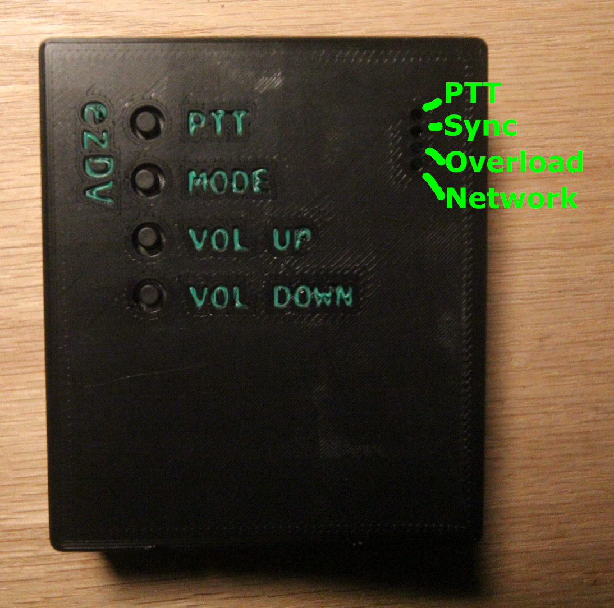

# Basic usage

## External controls

ezDV has four buttons on the left, in order from top to bottom:

* Push To Talk (PTT)
* Mode
* Volume Up
* Volume Down

as well as four status LEDs on the right hand side (again from top to bottom):

* PTT (red; on if transmitting)
* Sync (green; on if ezDV can decode an incoming FreeDV signal)
* Overload (red; on if the incoming RX/TX audio is clipping)
* Network (blue; will blink if it has a network connection and will be solid if connected to the radio)

These controls and LEDs are shown below:

## Powering ezDV on and off

To turn on ezDV, press and hold the Mode button for >= 1 second. All four LEDs on the right hand side
of the board should light briefly and then extinguish. You will also hear the last used
mode in Morse Code on your wired headset or through SmartSDR if using a Flex radio. (On first start, this
will be "700D", which corresponds to FreeDV 700D mode.) Holding this button again for >= 1 second will result
in ezDV turning off (with "73" also being piped through the headset in Morse Code, corresponding to the 
well-known ham radio term for "goodbye").

If Wi-Fi is enabled on ezDV, you will additionally hear the letter "N" emitted in Morse Code
once the network interface comes up. If ezDV is configured to connect to an existing wireless
network, you will hear the last octet of the IP address immediately afterward. For example,
if your router assigns the IP address "192.168.1.100" to ezDV, you will hear "N100" in the headset.

*Note: if your wireless network is configured with a "netmask" other than "255.255.255.0", you may need to
load your router's configuration to obtain the rest of ezDV's IP address. Otherwise, you can typically replace
the last octet of your computer's IP address with the number after the "N" when accessing ezDV with
a web browser.*

## FreeDV operation

Pushing the Mode button briefly while in receive will cycle through the following modes:

* FreeDV 700D ("700D" will beep in Morse code)
* FreeDV 700E ("700E" will beep in Morse code)
* FreeDV 1600 ("1600" will beep in Morse code)
* Analog passthrough ("ANA" will beep in Morse code)

The current FreeDV mode can also be adjusted using ezDV's web interface if preferred. See 
"Using the web interface" for more information.

Pressing and holding the PTT button will place the radio into transmit mode and transmit
a FreeDV signal out over the air (or your voice verbatim if you are in analog passthrough mode). 
If configured, you can also use the call button on your wired headset to place the radio into transmit;
pushing and releasing the call button will toggle between transmit and receive.

## Radio setup and usage

### Flex 6000 series

To use ezDV, simply start the SmartSDR software on your PC or iPad and select either FDVU mode (for upper sideband) 
or FDVL (for lower sideband). Decoded audio as well as Morse code beeps will be output to your speaker. Use the MOX
button in SmartSDR (or the PTT button on a microphone attached to the radio) to transmit, similar to when operarting 
the other voice modes.

### Others

If your radio has a "data" mode, it's recommended to enable this while using ezDV (or any FreeDV application
or device). This typically disables any processing the radio would normally do for SSB voice, preventing the 
signal from being garbled. Please see your radio's user manual for information about how to enable this mode.

## Volume controls

The Volume Up and Down buttons adjust the receive audio by default. If the PTT button is also held while
pushing Volume Up or Volume Down, the transmit audio level is adjusted instead. For best results, transmit 
audio should be adjusted while in 700D/700E/1600 mode such that the ALC indicator on your radio is just barely
showing (similar to how to configure data modes).

## Voice keyer

If configured, you can activate ezDV's voice keyer functionality by holding down PTT and then pressing the Mode
button. ezDV will then load the voice keyer file in its internal storage and play it back up to the number of
times configured (with it pausing a configured number of seconds). By default, ezDV is configured to transmit
the voice keyer file up to ten times, pausing for five seconds in between each transmission.

While the voice keyer is active, pressing any button on ezDV will stop the voice keyer and place it back into
regular operation. If using a Flex 6000 series radio, you can also stop the voice keyer by pushing the MOX button
in SmartSDR

Configuration of the voice keyer functionality (as well as stopping and starting of the voice keyer) can also be 
done via ezDV's web interface. See "Using the web interface" for more information.

## Summary of controls

| Button      | Action     | Also pressed | ezDV behavior                                                                              |
|-------------|------------|--------------|--------------------------------------------------------------------------------------------|
| PTT         | Hold       | (none)       | Places radio into transmit and outputs FreeDV signal/analog audio.                         |
|             | Hold       | Mode         | If voice keyer configured, activates voice keyer. Otherwise, cycles betweens FreeDV modes. |
|             | Hold       | Volume Up    | Increases transmit audio level.                                                            |
|             | Hold       | Volume Down  | Decreases transmit audio level.                                                            |
| Mode        | Press      | (none)       | Cycles between available FreeDV modes and analog passthrough.                              |
|             | Hold*      | (none)       | Powers up or shuts down ezDV.                                                              |
|             | Hold*      | PTT          | When off, powers up ezDV in Hardware Test Mode (see Troubleshooting).                      |
|             | Hold*      | Volume Down  | When off, powers up ezDV with default Wi-Fi settings (see "Using the web interface").      |
| Volume Up   | Press/Hold | (none)       | Increases ezDV volume through headset.                                                     |
| Volume Down | Press/Hold | (none)       | Decreases ezDV volume through headset.                                                     |

\* Must be held for at least one second.
