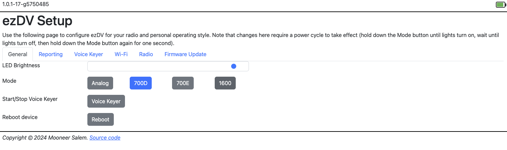
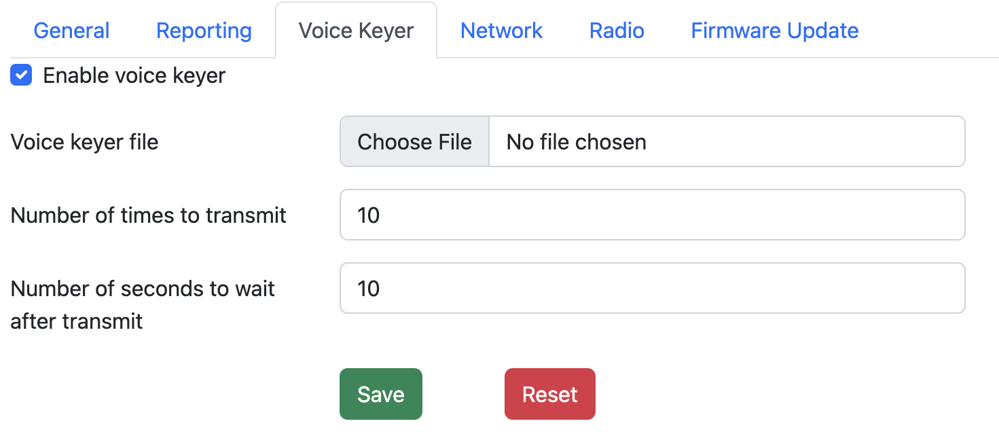
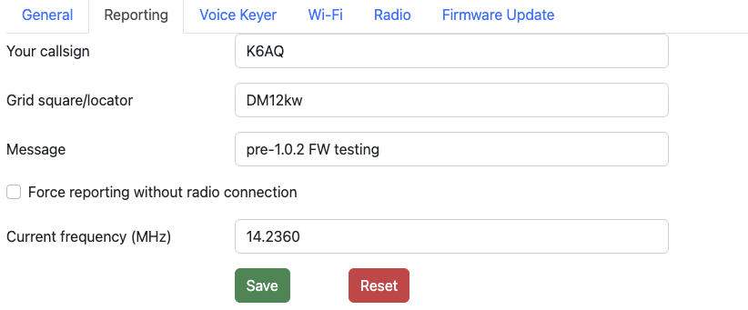
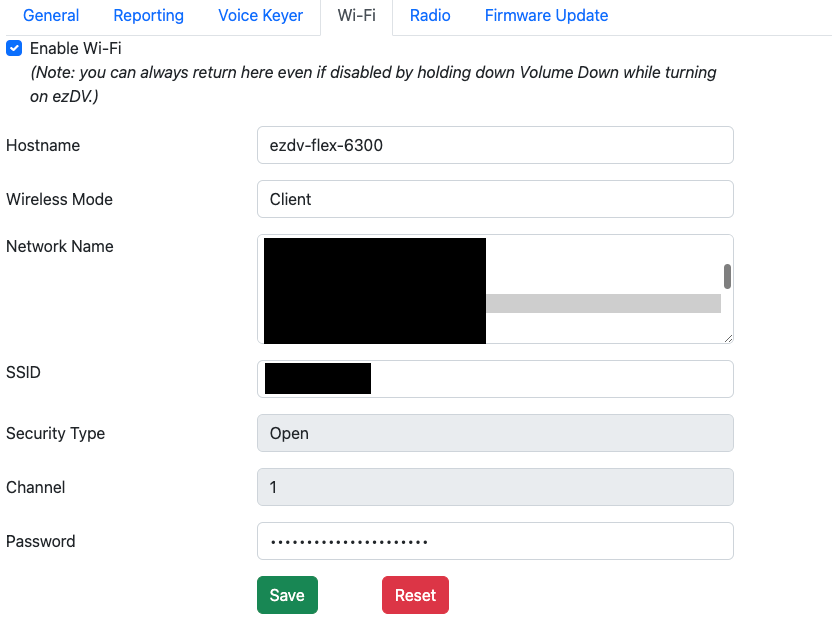
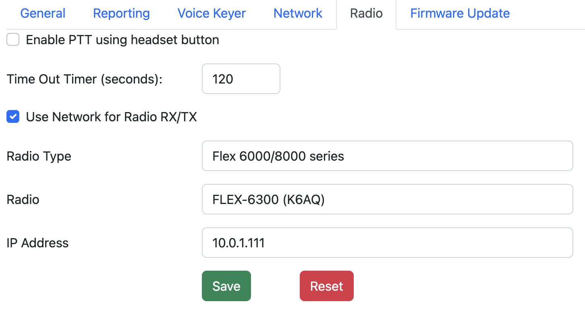
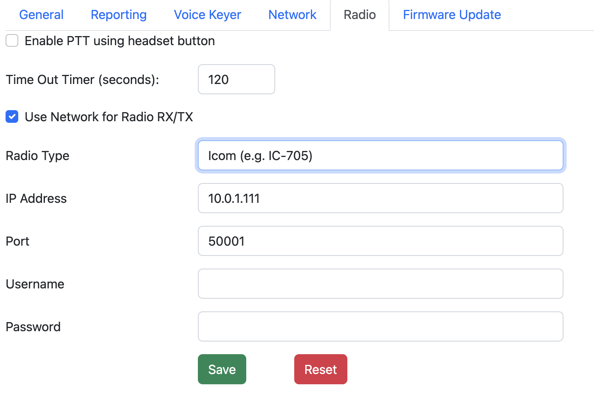

# Using the web interface

ezDV provides a web interface to allow users to adjust its configuration and operate some of its features.
When Wi-Fi is enabled on ezDV, this interface is accessible through a regular web browser (such as Google Chrome
or Microsoft Edge).

## Accessing the web interface

By default, Wi-Fi on ezDV is disabled for security reasons. To enable it (or recover from a bad configuration), 
hold down the Mode and Volume Down buttons until ezDV turns on. This will cause ezDV to create an access point
named "ezDV" followed by the last two octets of its MAC address. From there, you can connect your PC or mobile
device to that network and open http://192.168.4.1/ in your web browser.

If ezDV is configured to connect to an existing Wi-Fi network, you can open a web browser on a PC or mobile device
connected to the same network as ezDV and enter ezDV's IP address into the browser's location box. This IP address
can typically be found in your router's listing of connected devices; ezDV will also beep the letter "N" followed
by the last octet of the IP address when it connects to the network (for example, "N100" for "192.168.1.100").  

Alternatively, depending on your router, you can also use the configured hostname in your browser instead.
By default, ezDV's hostname is "ezdv", which means that you can enter http://ezdv/ instead of its IP address.

Regardless of how you access ezDV's web interface, you should see a page similar to the below:

From here, you can choose one of several tabs:

* General: Contains miscallenous ezDV configuration options.
* Reporting: Configures and operates the [FreeDV Reporter](https://qso.freedv.org/) reporting feature.
* Voice Keyer: Configures ezDV's voice keyer feature.
* Wi-Fi: Configures how ezDV connects to Wi-Fi.
* Radio: Configures how ezDV connects to your network-enabled radio.
* Firmware Update: Allows the user to perform a firmware update on ezDV.

## Changing FreeDV mode

The web interface provides the ability to change the current FreeDV mode, similar to when pushing the Mode
button on the top of ezDV. To change the current FreeDV mode, simply push one of the mode buttons in the General 
tab:

Once pushed, ezDV will behave identically as if the mode was switched using the Mode button, including beeping
the current mode in Morse Code through the wired headset.

## Changing LED brightness

ezDV allows you to change the brightness of the LEDs on the front of the device. This can make ezDV more comfortable
to use at night (for example). This can be done by going to the General tab and moving the LED Brightness slider:

Changes to the LED Brightness slider take effect immediately and are preserved, so it's not necessary to readjust
every time ezDV is powered off and then on again.

## Using and configuring the voice keyer

To activate and deactivate the voice keyer, you can push the Voice Keyer button in the General tab. When active,
the Voice Keyer button will turn red as shown below:

Pushing the button again will turn off the voice keyer:

If the voice keyer feature is disabled, the Voice Keyer button will be grayed out. In order to configure the voice
keyer, you will need to go into the Voice Keyer tab:

The following can be set here to enable the voice keyer feature:

| Setting | Description |
|---------|-------------|
| Enable voice keyer | When checked, this enables use of the voice keyer. The Voice Keyer button in the General tab will be allowed to be pushed, as well as be able to be activated by pushing on the Mode button on the front of ezDV while holding down PTT. |
| Voice keyer file | Allows uploading of a new voice keyer file. Optional if one has already been uploaded to ezDV.  *Note: ezDV requires a WAV file encoded with a sample rate of 8000 Hz and containing only one audio channel. If a file is uploaded that does not meet these requirements, ezDV will reject the upload.* |
| Number of times to transmit | The number of times that ezDV will transmit the voice keyer file before it disables the voice keyer. You can also disable the voice keyer early by pushing on the Voice Keyer button or pushing on any of the physical buttons on the front of ezDV. |
| Number of seconds to wait after transmit | The number of seconds to wait after transmitting the voice keyer file before starting another transmit cycle. |

Pushing Save will immediately update the voice keyer configuration and enable its use if desired.

## Reporting to FreeDV Reporter

ezDV has the ability to report its current state to the [FreeDV Reporter](https://qso.freedv.org/) spotting service. 
Operation of this feature can be done through the Reporting tab:

When configured with a callsign and grid square, ezDV will automatically connect to FreeDV Reporter if it has access
to an internet connection and is able to connect to a supported radio over Wi-Fi. You can also force a connection to
FreeDV Reporter for radios without Wi-Fi support by checking the "Force reporting without radio connection" checkbox
and manually entering the current frequency.

Once connected to FreeDV Reporter, a new row will appear corresponding to your connection:

If ezDV is able to decode a callsign from a received signal, it will transmit the received callsign and SNR to FreeDV
Reporter. Your row will then update to indicate the received callsign, SNR and mode as well as highlight your row in 
a blue background for several seconds to alert others that you've receiving a signal. When ezDV is transmitting, FreeDV
Reporter will also highlight your row with a red background to indicate to others that you're transmitting.

With radios that support connections over Wi-Fi, ezDV will also follow frequency changes on the radio and report them
to FreeDV Reporter. FreeDV Reporter will then indicate your current frequency, allowing others to change to your frequency
and potentially make a contact with you. Manual frequency updates (for those radios attached to ezDV with a wired connection)
will also be sent to FreeDV Reporter as they're made.

The following can be updated in the Reporting tab to operate FreeDV Reporter reporting:

| Setting | Description |
|---------|-------------|
| Your callsign | The callsign to report to FreeDV Reporter. This callsign is also transmitted as part of your FreeDV signal so that others can report receipt of your signal. |
| Grid square/locator | The 4-6 digit grid square to report to FreeDV Reporter. You can use a service such as [this](https://www.levinecentral.com/ham/grid_square.php) to calculate your grid square if not known. *Note: Clearing this field disables FreeDV Reporter reporting.* |
| Message | A short message to display on the FreeDV Reporter website next to your callsign. This is transmitted solely on the internet, not over RF. |
| Force reporting without radio connection | When checked, ezDV will connect to FreeDV Reporter even without a valid radio configuration. |
| Current frequency (MHz) | When "Force reporting without radio connection" is checked, ezDV will transmit this frequency to FreeDV Reporter as your current frequency.|

Pushing Save will immediately connect or disconnect to FreeDV Reporter (as desired/required) as well as transmit updates to the current frequency or short message.

## Configuring Wi-Fi

The Wi-Fi tab allows configuration of ezDV's Wi-Fi connection:

The following can be configured in this screen:

| Setting | Description |
|---------|-------------|
| Enable Wi-Fi | Enables or disables the Wi-Fi radio on ezDV. |
| Hostname | The name to call ezDV on the network (default "ezdv"). Only letters, numbers and '-' can be used for the name. |
| Wireless Mode | Can be either "Client" (to connect to an existing Wi-Fi network) or "Access Point" (to have ezDV generate its own Wi-Fi network). |
| Network Name | The Wi-Fi network to connect to in "Client" mode. ezDV populates this list with the networks that it's able to see, or you can choose "(other)" and manually enter the name of the network in the "SSID" field. |
| SSID | Typically automatically filled in if you select a network in the "Network Name" list. If "(other)" is selected, you can manually enter the name of the Wi-Fi network here (for example, if the network doesn't broadcast its presence). |
| Security Type | In "Access Point" mode, controls the security of the Wi-Fi network ezDV provides. Can be either "Open" (no encryption/security) or one of "WEP", "WPA", "WPA2" or "WPA/WPA2". *Note: WPA2 is recommended for the best security.* |
| Channel | In "Access Point" mode, this controls the 2.4 GHz Wi-Fi channel (1-11) ezDV uses. |
| Password | In "Access Point" mode (and when something other than "Open" is selected for "Security Type"), the password ezDV will require to allow other devices to connect to it. In "Client" mode, this is the password for the network selected or entered in "Network Name"/"SSID". |

Pushing Save here will save these settings to ezDV's internal flash but require rebooting or power cycling ezDV for the settings to take effect.

## Configuring radio connection and headset

The Radio tab allows configuration of ezDV's connection to a network-enabled radio as well as headset-related functions. 
Currently ezDV supports connections to the Icom IC-705 and Flex 6000/8000 series radios, as shown below:

The following can be configured in this screen:

| Setting | Description |
|---------|-------------|
| Enable PTT using headset button | Enables the usage of the "call" button on your wired headset for toggling PTT. (See [Basic usage](#basic-usage)" for more information.) |
| Time Out Timer (seconds) | Configures ezDV's "time out timer", which automatically puts the radio back into receive if the radio is stuck in transmit mode for too long. |
| Use Wi-Fi Network for Radio RX/TX | When checked, allows ezDV to connect to a supported radio over Wi-Fi instead of using a wired headset. |
| Radio Type | The type of radio that ezDV should connect to. This can be either "Flex 6000/8000 series" or "Icom (e.g. IC-705)". Relevant settings for each radio type will appear in this tab as appropriate. |
| Radio | Displays the list of Flex radios that ezDV is able to see on the network. You can also choose "(other)" and manually enter its IP address. |
| IP Address | For Flex radios, this is typically auto-filled when selecting a radio from the Radio list. Otherwise, this is the IP address of the radio which to connect to. |
| Port | For the IC-705, this is the control port number of the built-in server running on the radio. Defaults to "50001" and should not normally need to be changed. |
| Username | For the IC-705, this is the "Network User1" or "Network User2" user ID. (See [Configuring Wi-Fi on the IC-705](#appendix-configuring-wi-fi-on-the-icom-ic-705) or your radio's user manual for information on configuring these users.) |
| Password | For the IC-705, this is the "Network User1" or "Network User2" password. |

Pushing Save here will save these settings to ezDV's internal flash but require rebooting or power cycling ezDV for the settings to take effect.

## Updating firmware

From time to time, new ezDV firmware may be released that contains feature enhancements and/or bug fixes. These updates are typically posted
on the [project's releases page](https://github.com/tmiw/ezDV/releases) and are announced in various other locations (such as the FreeDV mailing lists). 
ezDV can be upgraded or downgraded by using the "Firmware Update" tab:

To update the firmware, perform the following steps:

1. Download the firmware file ending in "-ota.tar.gz" to your PC and save it to a known location (such as your Downloads folder).
2. Go to ezDV's "Firmware Update" tab and select the file you just downloaded. 
3. Press the "Update" button. *Note: this may take several minutes to complete. Do not close your browser or navigate away from the ezDV web interface while the update is taking place.*

Once complete, the new firmware is stored on ezDV's internal memory but will not take effect until ezDV is turned off and on again or rebooted.

## Rebooting ezDV

You can reboot ezDV from the web interface instead of powering it on and off using the physical controls. This is typically done after saving radio or Wi-Fi settings
or after uploading new firmware. To do this, go to the General tab and press the Reboot button:

ezDV may take up to a minute to turn itself off and then turn itself on again. Once the web browser is able to communicate with ezDV again, it will automatically
refresh the Web interface so that any changes to it due to any firmware updates can be made visible immediately.

*Note: changes to Wi-Fi settings may cause ezDV to no longer be accessible on the IP address that was originally used. See [Accessing the web interface](#accessing-the-web-interface) for 
information on finding its new address if required.*
