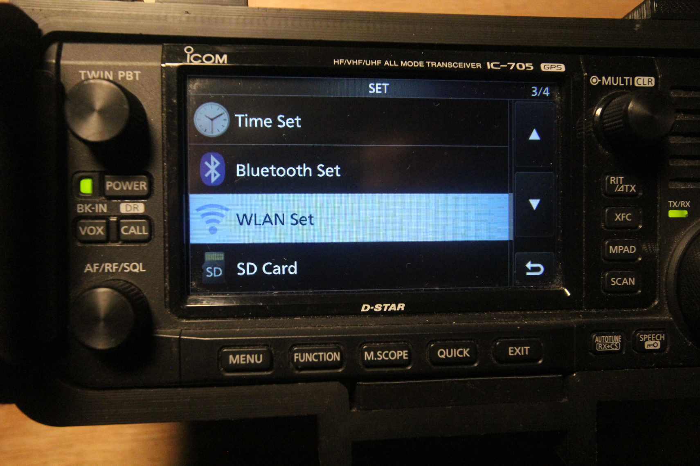
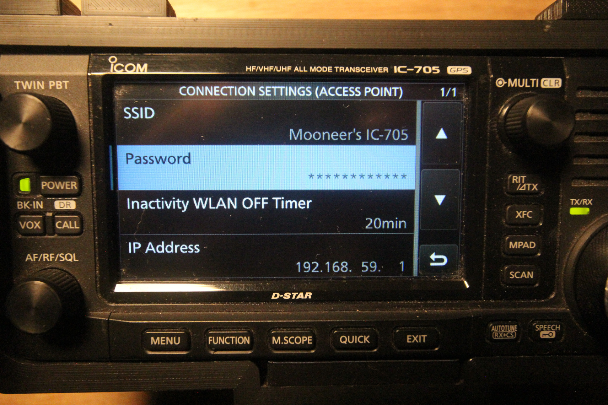
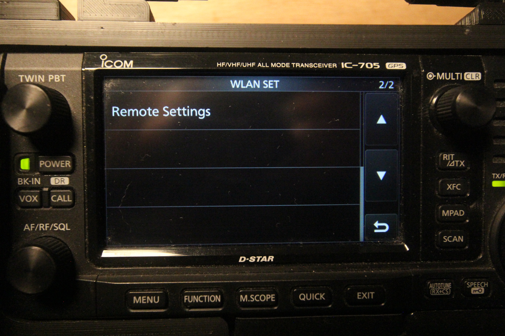
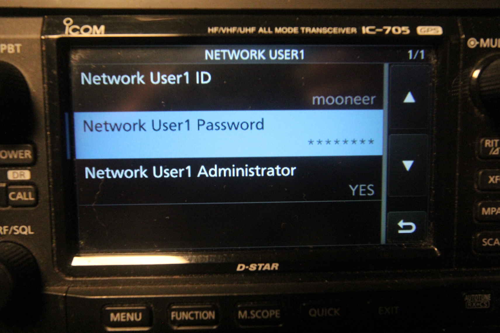
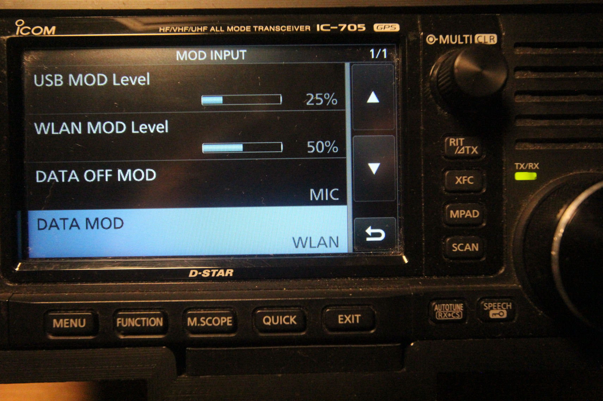
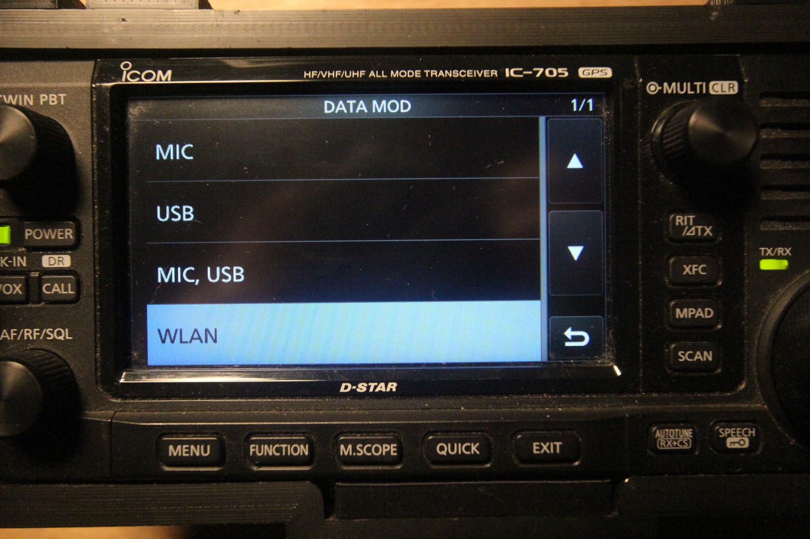

# Appendix: Configuring Wi-Fi on the Icom IC-705

First, you will need to decide whether you want to join your IC-705 to an existing Wi-Fi network or whether you want to configure 
ezDV to use the IC-705's built-in access point.

*Note: it is recommended to join your IC-705 to an existing Wi-Fi network in order to be able to access ezDV's Web interface
(and to take advantage of certain features if an Internet connection is available).*

Next, you'll need to turn on your radio and push the Menu button. This will bring up the following screen:

Tap the Set button on the lower-right corner of the display and then select "WLAN Set" as shown below:

Next, tap the WLAN option on the first page and turn it OFF. Once switched OFF, tap the Connection Type setting and tap either
Station (for connecting to an existing Wi-Fi network) or Access Point (for connecting ezDV to the IC-705's access point):

##### Configuring Wi-Fi on the IC-705

###### Using the IC-705's built-in access point

If you're using the IC-705's Access Point mode, it is a good idea to double-check your radio's SSID (aka Wi-Fi network name) and 
Wi-Fi password by tapping "Connection Settings (Access Point)" and then tapping each option as shown below, updating them as needed:

Also, note the IP address that your IC-705 is using on this page as you will need it for later configuration of ezDV. Once the settings
here are satisfactory, tap the Back button on the lower right hand corner of the screen, tap the WLAN option and then change it to ON.

###### Connecting the IC-705 to an existing network

First, tap the WLAN option on the WLAN Set page and change it to ON. This is needed in order to turn on the Wi-Fi radio in the IC-705
and allow it to scan for networks.

Next, tap "Connection Settings (Station)". You will see the following page on the IC-705:

From here, you can either tap "Access Point" to select your network from a list or "Manual Connect" if it's not broadcasting
its name. Tapping "Access Point" will bring up a page similar to the following:

Tap your preferred network from the list that appears. If it's not already saved in the IC-705, you may see a page similar
to the following:

Tapping Password will display the following page that will allow you to enter your Wi-Fi network's password:

Once entered, tap the ENT button to save it, then tap the Connect option to connect to the network. If successful,
the Access Point page will show "Connected" below your network's name. Tap the Back button until you return to the
"Connection Settings (Station)" page and make sure you see an IP address under "DHCP (Valid After Restart)":

Note this address as it will be needed for later configuration of ezDV.

##### Configuring the Radio User

The IC-705 requires a username and password to connect to the radio. If this is not already set up, you will need
to do so now before continuing with ezDV setup. First, ensure that you're on the "WLAN Set" page and then go to the
second page of options. You will see a "Remote Settings" option:

Tap on "Remote Settings" and then tap on "Network User1":

The following page should appear. Tap on "Network User1 ID" and "Network User1 Password" and enter a username and password
(if not already saved). Make a note of these as you'll need them later. Additionally, make sure "Network User1 Administrator"
is set to "YES".

Tap the Back button until you reach the Set menu.

##### Configuring Audio

The IC-705 must be configured to accept transmit audio from the Wi-Fi interface in order for transmit with
ezDV to work properly. From the Set menu, select "Connectors" as shown below:

Next, scroll until you find the "MOD Input" option and then tap it to continue:

Finally, tap the "DATA MOD" option and ensure that it is set to "WLAN":

*Note: if you share the IC-705 with other data mode applications over USB (for example, WSJT-X for FT8), make sure
that "DATA MOD" is set to one of the "USB" options above when done using ezDV.*
