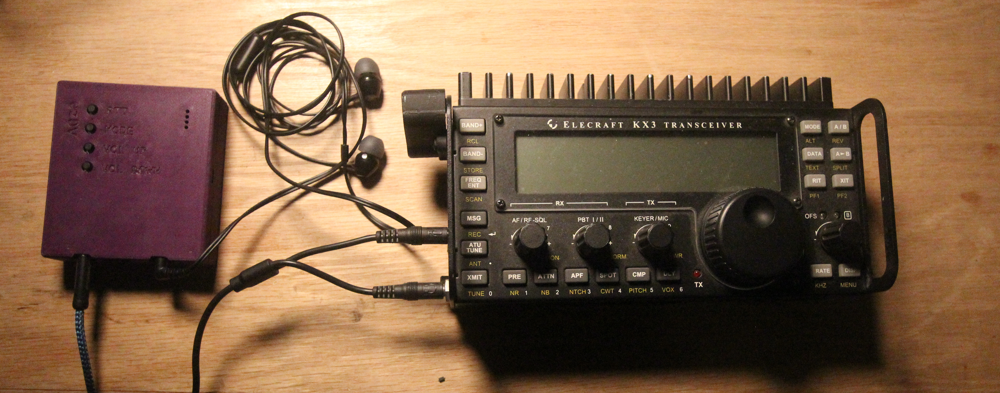

# Appendix: Example wiring configurations

Some example configurations are below.

## Elecraft KX3

If you have an Elecraft KX3, you can use off the shelf parts for your interface cable
(no soldering required). These parts consist of a [3.5mm splitter](https://www.amazon.com/Headphone-Splitter-KOOPAO-Microphone-Earphones/dp/B084V3TRTV/ref=sr_1_3?crid=2V0WV9A8JJMW9&keywords=headset%2Bsplitter&qid=1671701520&sprefix=headset%2Bsplitte%2Caps%2C136&sr=8-3&th=1)
and a [3.5mm TRRS cable](https://www.amazon.com/gp/product/B07PJW6RQ7/ref=ppx_yo_dt_b_search_asin_title?ie=UTF8&psc=1). The microphone
connector on the splitter should be plugged into PHONES on the KX3 while the speaker connector should be plugged into MIC.

This setup will look like the following when plugged in:

