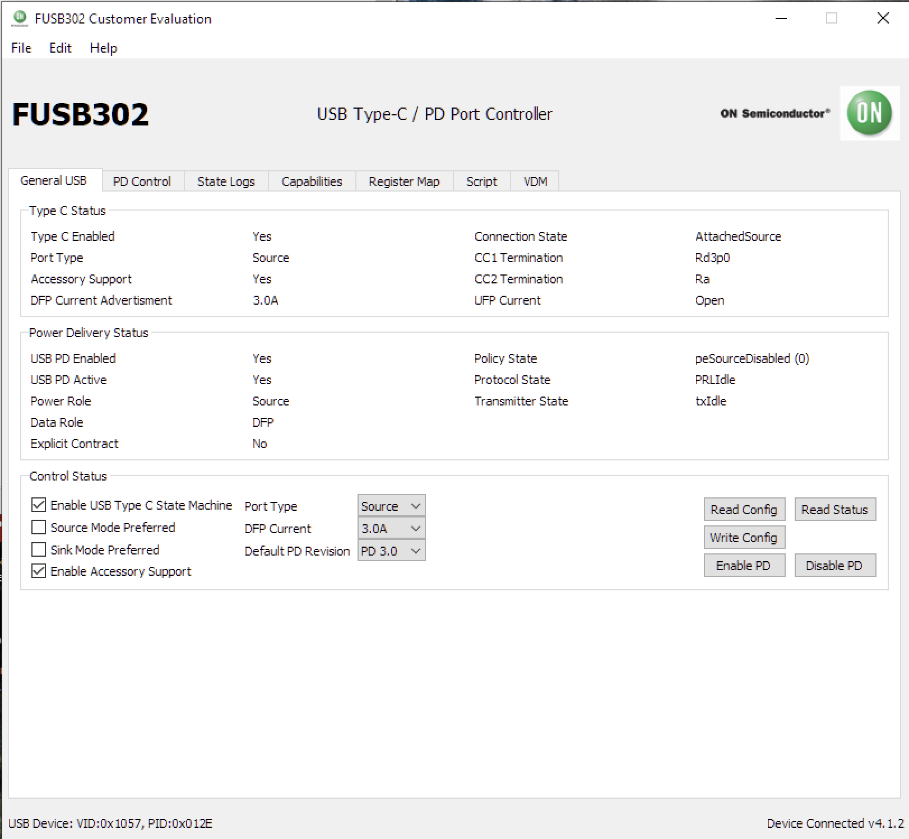
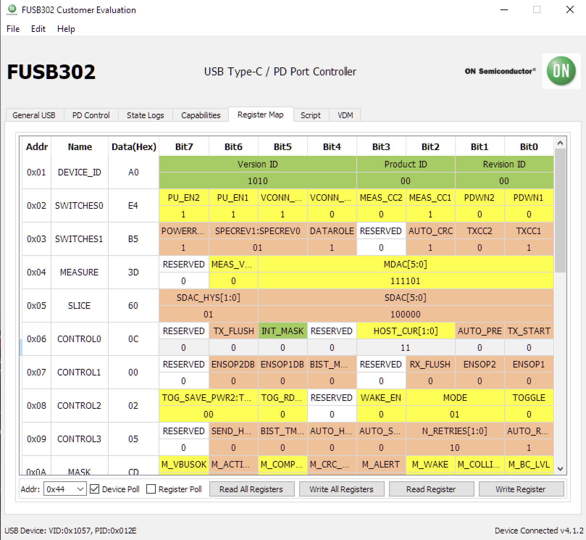

# ezDV dynamically limits current through USB-C while powered on

## Prerequisites

* [FUSB302 EVB](https://www.mouser.com/ProductDetail/863-FUSB302TGEVB) and [associated software](https://www.onsemi.com/pub/collateral/fusb302%20evb%20gui.zip).
* USB-C measurement cable (e.g. [these from Amazon](https://www.amazon.com/gp/product/B09V81BTMK/ref=ppx_yo_dt_b_asin_title_o04_s00?ie=UTF8&psc=1))
* 2000 mAh LiPo battery discharged to 3.6V or less

## Test Steps

1. Attach battery to ezDV.
2. Attach USB measurement cable to ezDV and the FUSB302 EVB. Attach micro-USB cable between PC and EVB.
3. Unzip the software mentioned above and execute the .exe file within the resulting folder. You should see something like the following:

4. On the "General USB" tab, select the following and click "Write Config":

    * *Port Type*: Source
    * *DFP Current*: 3.0A
    
5. Read measurement on cable. It should read as consuming a wattage that corresponds to a current over 500mA (for example, 3.6 W / 5 V = 0.72A).
6. Go to the "Register Map" tab, which looks like the following:

7. Click on the "HOST_CUR" value in row 0x06 and click on the "Read Register" button. This should result in this value becoming 11, corresponding to 3A current.
8. Modify "HOST_CUR" to read "01" instead of "11" and click on the "Write Register" button.

## Expected Results

Within 1-2 seconds after clicking on "Write Register", the measurement cable should read a wattage less than 2.5 watts (i.e. less than the 500 mA limit in the USB 2.0 specification).